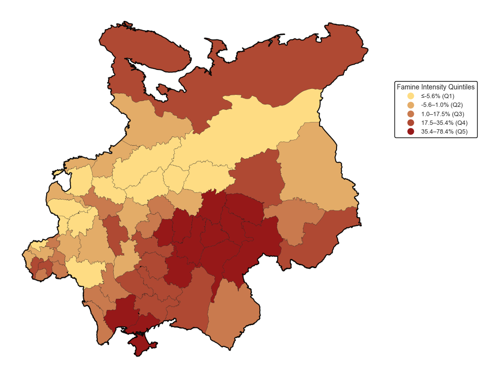
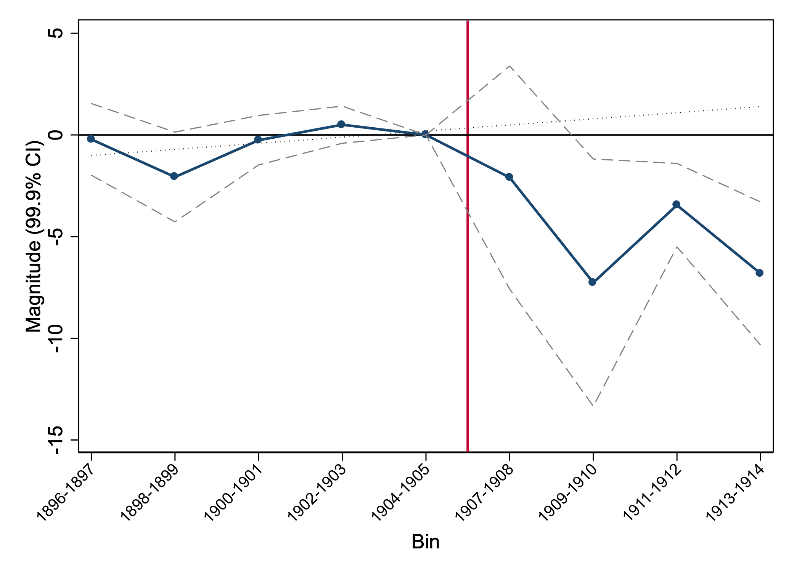

# How the 1891–1892 Famine Shaped Migration under the Stolypin Reforms

**Evidence from the Russian Empire**

## Research question

Can a historical humanitarian shock remain latent for years and influence migration once institutional barriers are removed?

This paper estimates the long-run effect of the 1891–1892 crop failure on peasant migration to Siberia after the Stolypin agrarian reforms of 1906. It uses a hand-collected province-level panel covering migration and economic conditions from 1896 to 1914, together with crop-yield information for the famine period and its pre-crisis baseline.

## Main finding

A one-percentage-point increase in famine severity, measured by the 1891 decline in winter-grain yields relative to the 1888–1890 baseline, is associated with approximately five additional migrants per 100,000 inhabitants after the reforms. A one-standard-deviation famine shock corresponds to an increase of roughly 50% of the mean post-reform migration rate.

The results are consistent with the idea that the Stolypin reforms unlocked a latent “economic memory”: the areas most affected by the famine responded more strongly once resettlement costs and institutional restrictions were reduced.

## Empirical approach

- 60 provinces of the Russian Empire;
- annual migration outcomes from 1896 to 1914;
- continuous-treatment difference-in-differences;
- event-study estimates;
- province and year fixed effects;
- province-specific trends;
- time-varying economic and demographic controls; and
- placebo, alternative-measure, and sensitivity checks.

## Paper

[Read the full bilingual paper](paper/famine-stolypin-migration.pdf)

## Author

Aleksei Ostapolets

Bachelor’s thesis, Joint HSE–NES Programme in Economics, 2025

## Code and data

This first portfolio release contains the paper and selected figures only. The hand-collected historical data and analysis code are not public at this stage. They can be documented and released later after a source-by-source review of archival attribution and redistribution rights.

## Suggested citation

Ostapolets, A. (2025). *How the 1891–1892 Famine Shaped Migration under the Stolypin Reforms: Evidence from the Russian Empire*.

